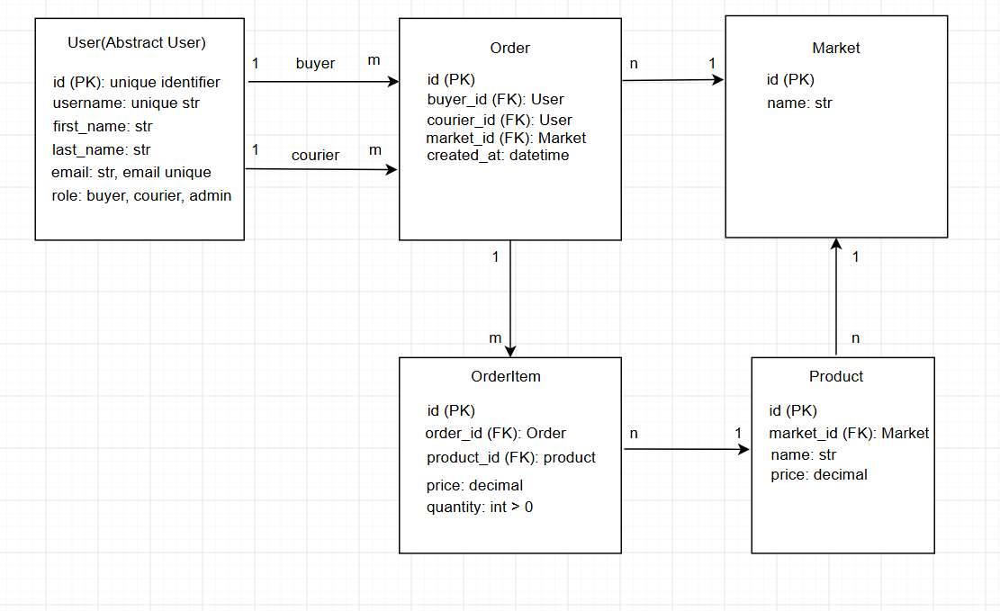

# Delivery Service

A learning Django project: a marketplace with delivery. A buyer picks a
market and products and places an order, a courier picks up free orders,
and an administrator manages the catalogue and assigns couriers by hand.

## Features

- **User roles** - `buyer`, `courier`, `admin`, plus the regular Django
  `is_staff` flag for access to `/admin/`. Signing up on the site
  (`/signup/`) creates a buyer or a courier; the `admin` role is only
  assigned through the admin panel.
- **Catalogue** - markets (`Market`) and products (`Product`); a product
  always belongs to exactly one market. Creating and deleting is
  staff-only, browsing is open to any logged-in user.
- **Orders** - a buyer creates an order in two steps: first pick a
  market, then pick that market's products with a quantity (one number
  field per product, so the same product can never be picked twice).
  The order and all of its items are created in a single transaction.
- **Delivery** - an unclaimed order (no courier yet) shows a "Take"
  button in the list; taking an order is an atomic database update, so
  two couriers can never claim the same order at the same time. Staff
  can assign or reassign a courier manually.
- **Access control** - every action (create/delete/take an order,
  assign a courier, manage the catalogue) is checked by role at the
  view level; buttons in the UI only appear for users who can actually
  perform the action.
- **Search and pagination** - `?q=` search on every list page (markets,
  products, orders, buyers, couriers), with the search term preserved
  while paging through results.
- **Buyer stats** - order count and total amount spent (`Total spent`)
  are computed with a single database aggregation query.

## Stack

- Python 3.14, Django 6.0.7 (SQLite out of the box, migrations live in
  `delivery/migrations/`)
- Bootstrap 5.3 + Bootstrap Icons, loaded from a CDN; the only custom
  CSS is `delivery/static/delivery/app.css`

## Setup

```bash
git clone <url> delivery_service
cd delivery_service

python -m venv .venv
.venv\Scripts\activate        # Windows
# source .venv/bin/activate   # Linux/macOS

pip install -r requirements.txt
```

`requirements.txt` pins Django plus the packages needed to deploy on
Render (`psycopg2-binary`, `dj-database-url`, `gunicorn`, `whitenoise`,
`python-dotenv`) and to lint (`flake8` and friends). None of the
deployment packages are required to just run the project locally with
SQLite.

## Configuration

Settings are split into a package, `delivery_service/settings/`:

- `base.py` - shared config, imported by both of the below.
- `dev.py` - local development: SQLite, `DEBUG = True`, no real
  secrets required. This is the default (`manage.py`, `wsgi.py`, and
  `asgi.py` all point `DJANGO_SETTINGS_MODULE` here).
- `prod.py` - Render.com: `DEBUG = False`, Postgres via `DATABASE_URL`,
  and every secret read from the environment with no insecure fallback.

`dev.py` loads a local `.env` file if one exists (via `python-dotenv`),
so you can override anything without touching settings code. Copy
`.env.example` to `.env` if you want that; it's entirely optional
locally since everything already has a safe default.

One setting worth knowing about regardless of environment:

- `AUTH_USER_MODEL = "delivery.User"` - a custom user model with a
  `role` field. This can only be changed **before** the first migration.

## Running the server

```bash
python manage.py migrate
python manage.py runserver
```

The site is served at `http://127.0.0.1:8000/`, the admin panel at
`/admin/`.

## Loading sample data

A ready-made fixture ships at `delivery/fixtures/demo_data.json`: a
compact, realistic dataset - 4 markets (Fresh Market, Corner Bakery,
Harbor Fish & Meat, Pantry Staples), 14 products with real names and
prices, 6 buyers, 3 couriers, 1 administrator, and 12 orders (some
already claimed by a courier, some still free so you can try the
"Take" button right away). Order dates are yesterday and today.

```bash
python manage.py migrate
python manage.py loaddata demo_data
```

Password for every demo account: **`demo-pass-12345`**.

Accounts:

| Username | Role |
|---|---|
| `demo.admin` | administrator (staff + superuser) |
| `olena.k`, `dmytro.s`, `iryna.b`, `andrii.m`, `sofiia.t`, `maksym.p` | buyer |
| `courier.taras`, `courier.alina`, `courier.roman` | courier |

You can also create a superuser with your own username and password:

```bash
python manage.py createsuperuser
```

## Tests

```bash
python manage.py test
```

Tests live in `delivery/tests/` (`test_models.py`, `test_forms.py`,
`test_views.py`) - models, forms, and role-based permissions.

## Deployment (Render.com)

The project deploys as a Render Blueprint (`render.yaml`), which
provisions a free Postgres database and a free web service together.

1. Push the repo to GitHub.
2. In the Render dashboard: New -> Blueprint, point it at the repo.
   Render reads `render.yaml` and creates both the database and the
   web service.
3. `DJANGO_SECRET_KEY` is generated automatically by the blueprint;
   `DATABASE_URL` is wired to the new database automatically;
   `RENDER_EXTERNAL_HOSTNAME` is set automatically by Render itself.
   Nothing to fill in by hand.
4. First deploy runs `build.sh` (`pip install`, `collectstatic`,
   `migrate`, `loaddata demo_data`), then starts
   `gunicorn delivery_service.wsgi:application`. The demo accounts
   from "Loading sample data" above work on the live site too.

Relevant files:

- `render.yaml` - the Blueprint: web service + database + env vars.
- `build.sh` - build step run on every deploy.
- `.python-version` - pins the Python version Render builds with.
- `delivery_service/settings/prod.py` - `DEBUG = False`, Postgres via
  `dj-database-url`, HTTPS redirect/secure cookies, hashed+compressed
  static files via WhiteNoise.

To create a superuser on the deployed site, open a shell for the
service from the Render dashboard and run
`python manage.py createsuperuser`.

## ER Diagram 



